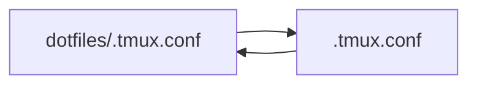

# Dotfiles
These are my dotfiles, primarly focus on MacOS.

# Tools
Install these tools.
* homebrew
* iterm
* tmux
* nvim
* luajit
* tree-sitter
* fish

## Note taking

Note taking is an important aspect of development. I think it's quite important to build a 2nd brain, or build a personalized wiki. 
For my note taking I use Obsidian. 

# Installation
Currently it's only possible to install these dotfiles manually.

## Linking files
Rather than moving files around it is a lot easier to link files using symlinks.

Here's an example of my `.tmux.conf` and how to link it on a new machine:

`ln -s ~/dotfiles/.tmux.conf ~/.tmux.conf`

Here is a diagram that show's how it works:

As the diagram shows above they will be linked, so any changes in either of the files will update both files.
# Shell setup
* Fish
* [Fisher](https://github.com/jorgebucaran/fisher) - plugin manager for fish
* Peco
* Lazy git
* z for fish
* exa
# Todo
* Set up installation script
* Create better documentation
* Describe how I use lynx and pandoc to view md files in terminal

